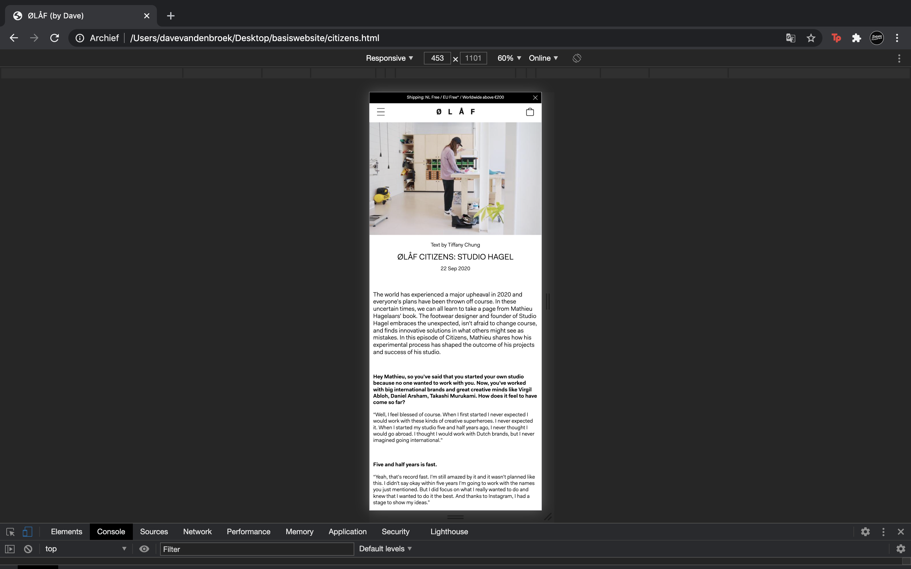
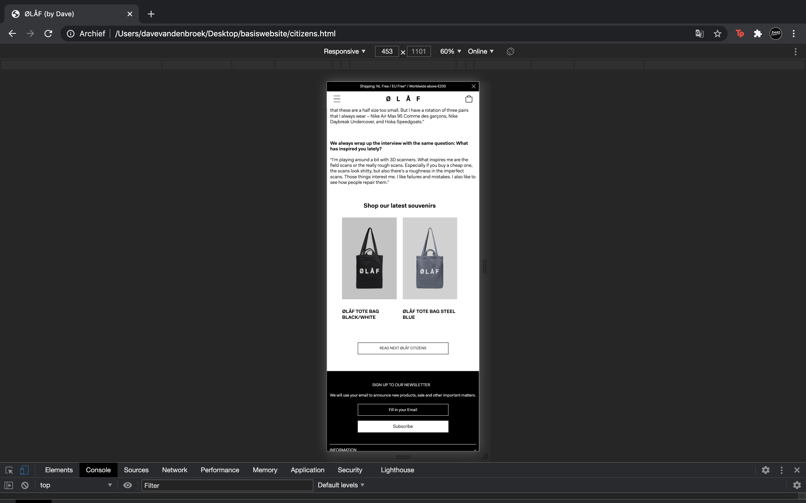
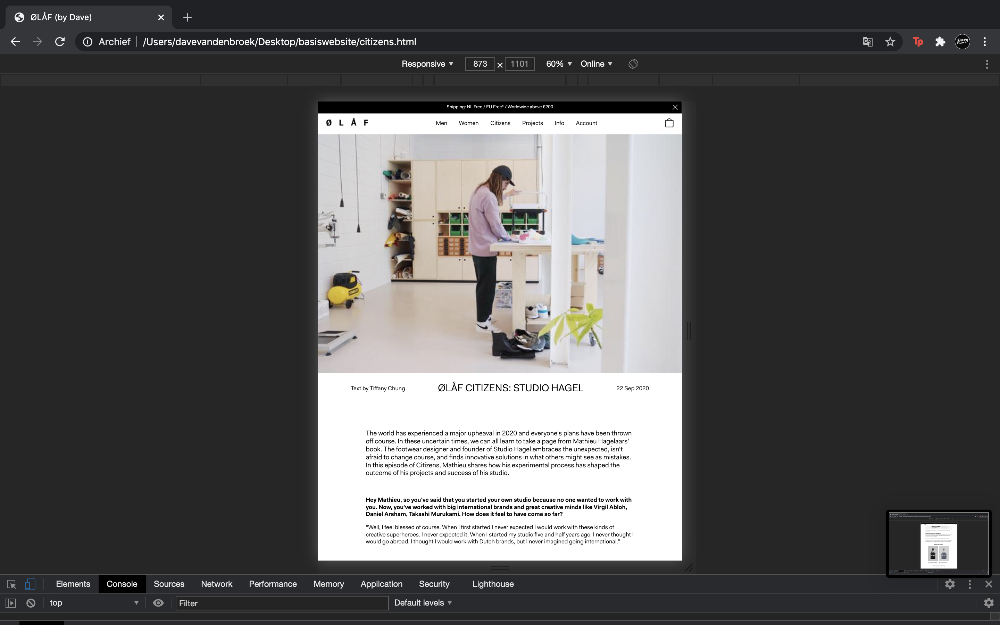
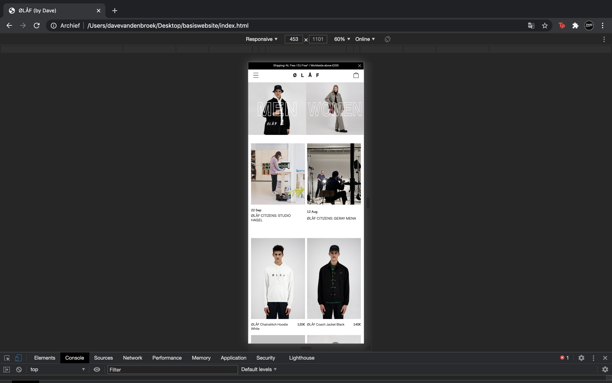
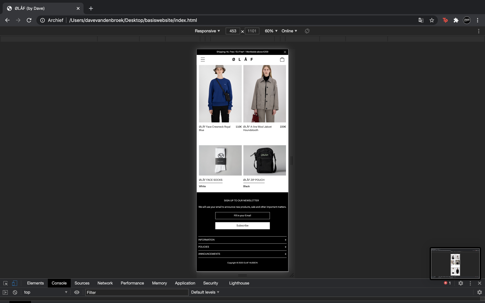
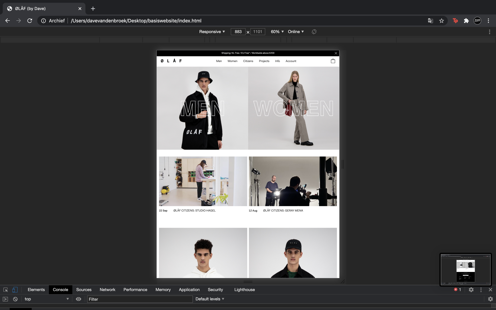
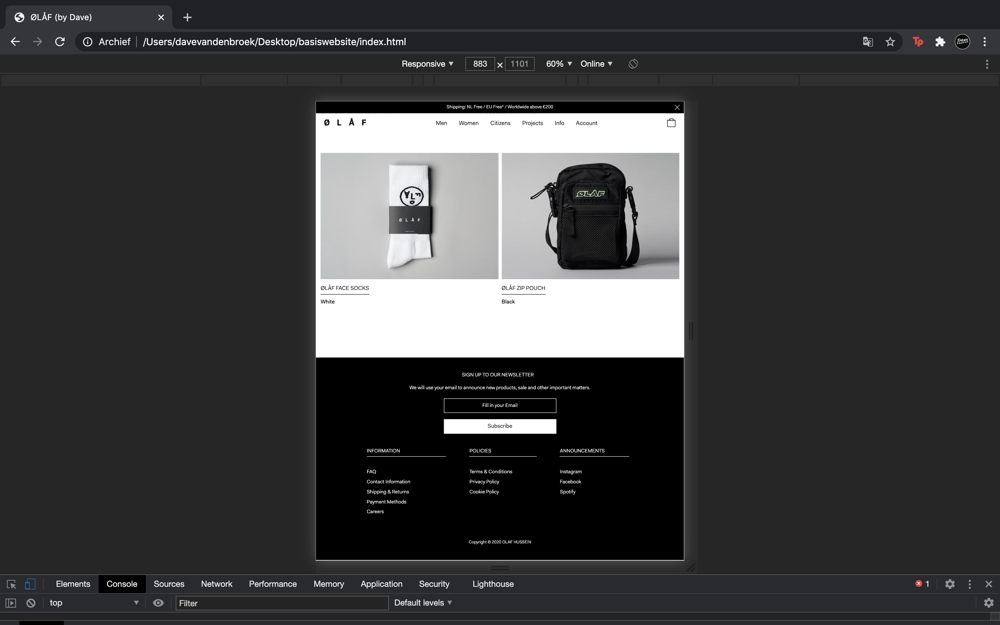
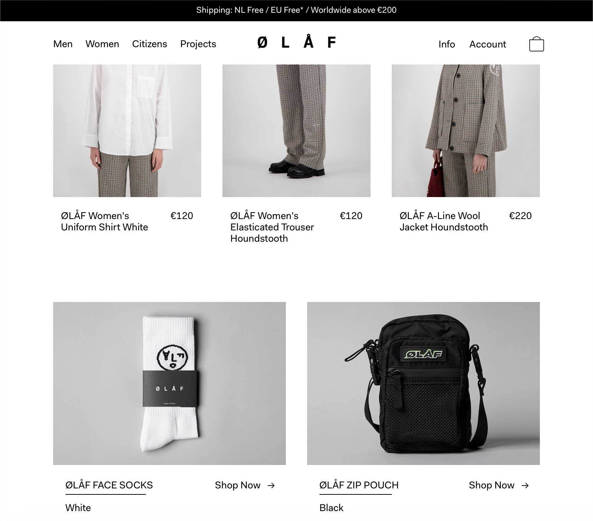
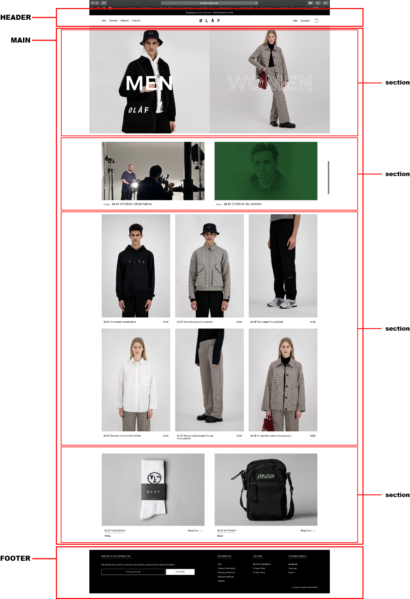
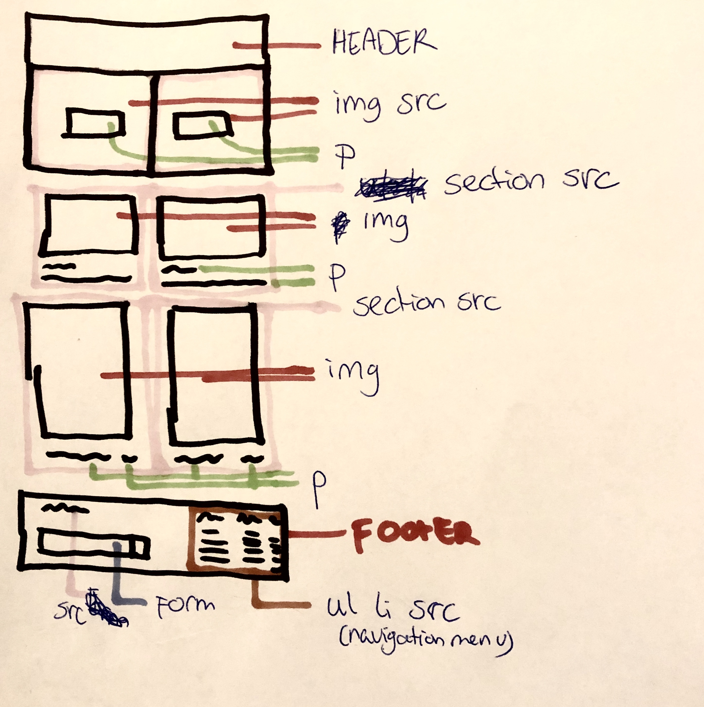

# Procesverslag
**Auteur:** Dave van den Broek

## Eindgesprek (week 7/8)

Het eerste eindgesprek heb ik erg prettig ervaren, ik was voor mijn gevoel nog niet helemaal klaar met mijn code om deze beoordeeld te kunnen laten worden. Toch met Sanne naar mijn code gekeken en mijn gevoel werdt bevestigd door Sanne, het was nét niet goed genoeg. Ik merk dat ik vaak wat te perfectionistisch ben en niet snel genoegen met mijn code neem. Daardoor heb ik niet alles kunnen doen wat ik bij het begin van dit blok voor ogen had. Wel heb ik een heleboel andere dingen geleerd en toegepast aan mijn site. Zo heb ik leren werken met grid en flex, die ik voor dit blok nog nooit gebruikt had. Ook heb ik een beter overall inzicht gekregen in de mogelijkheden van CSS.

**Screenshot(s):**

## Voortgang 3 (week 6)

Weinig daadwerkelijke vooruitgang kunnen maken omdat mijn site steeds maar bleef instorten. Ik besloot mijn hele HTML aan te gaan passen en alle content die in mijn main staat tot 1 grote grid te maken. Hopelijk gaat dit een hoop versimpelen.

## Voortgang 2 (week 5)

Ik ben al een eind gekomen met mijn homepage, ik heb de nav laten werken op mobile, hij is mooi buiten beeld en schuift netjes naar binnen op het moment dat deze getriggerd wordt in javascript.

## Voortgang 1 (week 3)

### Stand van zaken

Ik ben nog niet begonnen aan mijn tweede pagina en ook mijn eerste is nog niet helemaal af, ik ben vooral aan de slag gegaan met de dingen die mij leuk leken om te leren. Vanaf deze week ga ik mijn site langzamerhand compleet proberen te maken. 

**Screenshot(s):**

### Verslag van meeting

Ik ben goed op weg maar moet wel een beetje sneller gaan werken, ik blijf hangen in details waardoor ik weinig grote stappen maak. Het is niet erg want op deze manier vindt ik het leuk maar is wel erg tijdsrovend.

## Intake (week 1)

**Je startniveau:** Blauw/Rood _(ertussenin?)_

**Je focus:** Responsive

**Je opdracht:** https://olafhussein.com

**Screenshot(s):**

**Breakdown-schets(en):**

